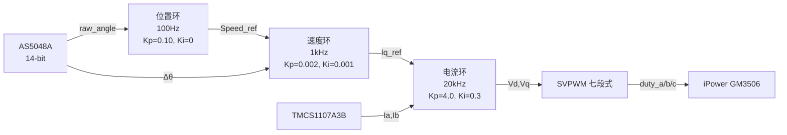

# STM32G431CBU6_MMSD — 无刷直流电机 FOC 矢量控制项目

> **主控**: STM32G431CBU6 (Cortex-M4 @ 170MHz)  
> **驱动**: DRV8313 三相 MOSFET 预驱动  
> **编码器**: AS5048A 14-bit 磁旋转编码器 (SPI)  
> **电流传感**: TMCS1107A3B (200mV/A, 双向)  
> **目标电机**: iPower GM3506 云台无刷电机 (24N22P, 11 对极)  
> **开发环境**: STM32CubeMX + VS Code + CMake + ARM GCC

> **[🇬🇧 View in English](README_EN.md)**

---

## 目录

- [项目概述](#项目概述)
- [硬件架构](#硬件架构)
- [软件分层](#软件分层)
- [控制方案](#控制方案)
- [运行模式](#运行模式)
- [工程结构](#工程结构)
- [快速开始](#快速开始)
- [调参指南](#调参指南)
- [调试接口](#调试接口)
- [项目日志](#项目日志)

---

## 项目概述

本项目是一个基于 **STM32G431CBU6** 微控制器的**无刷直流电机（BLDC）磁场定向控制（FOC）** 工程，目标电机为 **iPower GM3506 云台电机**。

项目采用 **位置-速度-电流三环串级控制** 架构，支持：
- **自动步进模式** — 每隔 1 秒自动旋转 6°，用于演示和基础测试
- **手动示教模式** — 手动拧到目标位置，保持 6 秒后锁定
- **阻尼模式** — 转动时有阻力，松手即自由停止

工程代码采用清晰的**四层架构**（驱动层 → 控制层 → 应用层），各层解耦、接口统一，便于维护和移植。

---

## 硬件架构

### 器件清单

| 器件 | 型号 | 说明 |
|------|------|------|
| 主控 MCU | STM32G431CBU6 | Cortex-M4, 170MHz, FPU, DSP 指令 |
| 电机驱动 | DRV8313 | 三相 MOSFET 预驱动，带 nFAULT 保护 |
| 磁编码器 | AS5048A | 14-bit (0~16383), SPI 接口 |
| 电流传感器 | TMCS1107A3B | 200mV/A, 零电流=1.65V |
| 目标电机 | iPower GM3506 | 24N22P, 11 对极, 5.6Ω, 1A@12V |

### 引脚映射

| 功能 | 引脚 | 外设 |
|------|------|------|
| PWM A 相高侧 | PA8 | TIM1_CH1 |
| PWM B 相高侧 | PA9 | TIM1_CH2 |
| PWM C 相高侧 | PA10 | TIM1_CH3 |
| 相电流 Ia | PA0 | ADC1_IN1 |
| 相电流 Ib | PA1 | ADC1_IN2 |
| 母线电压 | PA7 | ADC2_IN4 |
| 母线电流 | PA6 | ADC2_IN3 |
| 编码器 SCK | PB3 | SPI1_SCK |
| 编码器 MISO | PB4 | SPI1_MISO |
| 编码器 MOSI | PB5 | SPI1_MOSI |
| 编码器 CS | PA15 | GPIO 软件片选 |
| nFAULT 中断 | PB11 | EXTI 下降沿触发 |
| LED 指示灯 | PC6 | GPIO 输出 |

### 时序概览

```
┌─────────────────────────────────────────────────────────┐
│ TIM1 (20kHz / 50µs)  →  触发 ADC1 → 电流采样 + FOC 算法  │
│   ├── ADC1 转换:     ~6µs                                  │
│   ├── SPI 读编码器:  ~10µs                                 │
│   └── FOC 算法:      ~16µs  (Clarke→Park→PI→InvPark→SVPWM) │
├─────────────────────────────────────────────────────────┤
│ TIM6 (1kHz / 1ms)     →  速度环 PI  →  更新 Iq 给定       │
├─────────────────────────────────────────────────────────┤
│ TIM7 (100Hz / 10ms)   →  位置环 PI  →  更新 Speed 给定     │
├─────────────────────────────────────────────────────────┤
│ main 主循环           →  LED 心跳 + 故障恢复 + 模式管理    │
└─────────────────────────────────────────────────────────┘
```

---

## 软件分层

项目采用清晰的**四层架构**，从底向上依次为：

### 1️⃣ 驱动层 (DriverLayer)

直接操作 MCU 外设寄存器，提供最底层的硬件抽象。

| 模块 | 文件 | 功能 |
|------|------|------|
| ADC 采样 | `drv_adc_sampling` | ADC1/ADC2 双通道 DMA 循环采样，电流/电压检测 |
| SPI 编码器 | `drv_spi_as5048a` | AS5048A 14-bit 磁编码器 SPI 驱动 |
| PWM 输出 | `drv_tim_pwm` | TIM1 六路互补 PWM，20kHz，死区可配 |
| nFAULT 保护 | `drv_nfault` | DRV8313 故障中断处理，紧急关断 MOE |

### 2️⃣ 控制层 (ControlLayer)

核心 FOC 算法与数学库，不依赖 HAL，可独立测试。

| 模块 | 文件 | 功能 |
|------|------|------|
| 数学库 | `ctl_math` | Clarke/Park/InvPark 坐标变换 + SVPWM 七段式调制 |
| PID 控制器 | `ctl_pid` | 并行式 PID，setpoint 加权，条件积分抗饱和，微分低通滤波 |
| FOC 核心 | `ctl_foc_core` | FOC 主结构体、状态机、系统初始化、故障检测 |
| 开环控制 | `ctl_foc_openloop` | 虚拟旋转磁场，无传感器/无 PI，用于硬件验证 |
| 电流闭环 | `ctl_foc_current` | Id=0 策略，PI 控制，编码器校准 |
| 速度闭环 | `ctl_foc_speed` | 速度 PI 控制器，差分测速 |
| 位置闭环 | `ctl_foc_position` | 位置 PI 控制器，编码器角度展开（无回绕） |
| 阻尼模式 | `ctl_foc_damper` | 转动阻力模式，Iq=-gain×speed，纯比例负反馈 |
| 调试输出 | `ctl_foc_debug` | USART1 CSV 格式打印，Excel/Python 可绘图 |

### 3️⃣ 应用层 (ApplicationLayer)

封装业务逻辑，main.c 仅保留硬件初始化骨架。

| 模块 | 文件 | 功能 |
|------|------|------|
| 应用初始化 | `app_foc` | `App_Init()` — FOC 系统初始化 + 模式分发 |
| 主循环任务 | `app_foc` | `App_Run()` — LED 心跳 + 故障恢复 + 位置控制 |

### 4️⃣ 硬件抽象层 (Core / Drivers)

STM32CubeMX 生成的 HAL 驱动和硬件初始化代码。

| 模块 | 功能 |
|------|------|
| Core/Inc | 外设头文件 (adc, dma, fdcan, gpio, spi, tim, usart) |
| Core/Src | 外设初始化代码 + main.c + 中断处理 |
| Drivers/CMSIS | ARM Cortex-M4 CMSIS 核心 |
| Drivers/STM32G4xx_HAL | STM32G4 HAL 驱动库 |

---

## 控制方案

### 三环串级控制



### 电流环 (20kHz, TIM1)

- 策略: **Id=0**（最大化转矩电流比）
- 控制周期: **50µs**
- 算法流程: 读 ADC → 读编码器 → Clarke 变换 → Park 变换 → **双 PI (Id/Iq)** → InvPark → SVPWM
- PI 参数: **Kp=4.0, Ki=0.3**，限幅 ±12V
- 电流滤波: **IIR α=0.3** (截止频率 ~955Hz)

### 速度环 (1kHz, TIM6)

- 测速方式: 编码器电角度差分，回绕检测
- 控制周期: **1ms**
- 输出限幅: ±1A（钳位到 Iq_ref）
- PI 参数: **Kp=0.002, Ki=0.001**

### 位置环 (100Hz, TIM7)

- 编码器展开: 无回绕累计，每步检测 ±8192 跳变
- 控制周期: **10ms**
- 输出限幅: ±500RPM（钳位到 speed_ref）
- PI 参数: **Kp=0.10, Ki=0** (纯 P 控制)

---

## 运行模式

### 1️⃣ 位置控制 — 自动步进模式

**宏开关**: `POS_AUTO_STEP = 1`

- 每 **1 秒** 步进 **2731 LSB**（≈ 60° 机械角）
- 位置环锁定目标角度，速度环/电流环跟随
- 适合：基础功能演示、控制效果评估

### 2️⃣ 位置控制 — 手动示教模式

**宏开关**: `POS_AUTO_STEP = 0`

- 手动旋转电机偏离当前位置
- 偏离 **>500 LSB** 后开始计时，保持偏离 **6 秒** 即锁定为新目标
- 松开后位置环回正到锁定位置
- 适合：机械装配校准、位置示教

### 3️⃣ 阻尼模式

**宏开关**: `FOC_MODE = FOC_MODE_DAMPER`

- 转动产生阻力（`Iq = -gain × speed`），无积分项
- 转动越快阻力越大，松手即自由停止
- 参数：默认阻尼增益 **0.03~0.1 A/RPM**
- 适合：测功机模拟、手感调试

### 4️⃣ 开环验证模式

用于硬件链路验证和电机首次转动测试，不依赖编码器反馈和 PI 参数。

- 软件生成虚拟旋转磁场
- 无需编码器校准
- 无传感器反馈，负载变化可能失步

---

## 工程结构

```
STM32G431CBU6_MMSD/
├── CMakeLists.txt              # CMake 构建文件
├── CMakePresets.json           # CMake 预设（Debug/Release）
├── startup_stm32g431xx.s       # 启动文件
├── STM32G431XX_FLASH.ld        # 链接脚本
├── STM32G431CBU6_MMSD.ioc      # STM32CubeMX 配置
│
├── ApplicationLayer/           # 应用层
│   ├── Inc/app_foc.h
│   └── Src/app_foc.c
│
├── ControlLayer/               # 控制层（FOC 算法核心）
│   ├── Inc/                    # 头文件
│   │   ├── ctl_math.h          #   坐标变换 & SVPWM
│   │   ├── ctl_pid.h           #   PI/PID 控制器
│   │   ├── ctl_foc_core.h      #   FOC 基础设施
│   │   ├── ctl_foc_current.h   #   电流闭环
│   │   ├── ctl_foc_speed.h     #   速度闭环
│   │   ├── ctl_foc_position.h  #   位置闭环
│   │   ├── ctl_foc_openloop.h  #   开环控制
│   │   ├── ctl_foc_damper.h    #   阻尼模式
│   │   └── ctl_foc_debug.h     #   调试输出
│   └── Src/                    # 源文件（同名 .c）
│
├── DriverLayer/                # 驱动层
│   ├── Inc/
│   │   ├── drv_adc_sampling.h  #   ADC 电流/电压采样
│   │   ├── drv_spi_as5048a.h   #   AS5048A 编码器
│   │   ├── drv_tim_pwm.h       #   TIM1 PWM 输出
│   │   ├── drv_nfault.h        #   DRV8313 故障保护
│   │   └── drv_spi_as5048a_debug.h
│   └── Src/                    # 源文件
│
├── Core/                       # STM32CubeMX 生成
│   ├── Inc/                    # 外设头文件 + main.h
│   └── Src/                    # 外设初始化 + main.c + 中断
│
├── Drivers/                    # CMSIS + STM32G4 HAL 库
│
├── cmake/                      # CMake 工具链
│   ├── gcc-arm-none-eabi.cmake
│   ├── starm-clang.cmake
│   └── stm32cubemx/            # CubeMX 生成的 CMake
│
└── document/                   # 文档
    ├── 编程日志.txt
    ├── FOC_项目深度复盘.md
    └── FOC_项目总结与面试准备.md
```

---

## 快速开始

### 环境要求

- **VS Code** (推荐) 或 STM32CubeIDE
- **ARM GCC 工具链** (`arm-none-eabi-gcc`)
- **CMake** ≥ 3.22
- **STM32CubeMX** (用于重新生成初始化代码)
- **串口工具** 115200-8-N-1 (用于调试输出)

### 编译

```bash
# Debug 模式
cmake --preset debug
cmake --build build/Debug

# Release 模式
cmake --preset release
cmake --build build/Release
```

### 烧录

使用 ST-Link 工具烧录：

```bash
# 使用 STM32_Programmer_CLI
STM32_Programmer_CLI --connect port=SWD --write build/Debug/STM32G431CBU6_MMSD.hex --verify
```

或通过 VS Code + Cortex-Debug 扩展进行调试烧录。

### 运行

1. 连接电机（iPower GM3506）至 DRV8313 输出端
2. 连接 12V 电源至驱动板
3. 上电后程序自动初始化 FOC 系统
4. LED (PC6) 以 **1Hz** 闪烁表示正常运行
5. 电机按当前模式运行（自动步进 / 手动示教 / 阻尼）

---

## 调参指南

### 电流环 PI 参数

| 参数 | 推荐值 | 说明 |
|------|--------|------|
| Kp (Id/Iq) | 2.0~6.0 | 比例增益：越大响应越快，过高导致震荡 |
| Ki (Id/Iq) | 0.1~0.5 | 积分增益：消除静差，过高引入低频振荡 |
| 输出限幅 | ±Vbus | 建议设为母线电压值 |
| 积分限幅 | ±Vbus×0.3 | 抗饱和，防止积分深度饱和 |

**调参步骤**:
1. 编码器校准正确后，锁定电机轴（或带大惯量负载）
2. 先设 Ki=0，增大 Kp 直到电流响应出现临界震荡
3. 取临界 Kp 的 **60%~80%** 作为最终 Kp
4. 加入 Ki ≈ Kp × 0.05~0.1
5. 用示波器或串口观察 Id/Iq 跟踪效果

### 速度环 PI 参数

| 参数 | 推荐值 | 说明 |
|------|--------|------|
| Kp | 0.001~0.005 | 比例增益：控制速度响应 |
| Ki | 0.0005~0.002 | 积分增益：消除速度静差 |
| 输出限幅 | ±1.0A | 钳位到电流环 Iq_ref |

### 位置环 PI 参数

| 参数 | 推荐值 | 说明 |
|------|--------|------|
| Kp | 0.05~0.20 | 比例增益：控制位置刚度 |
| Ki | 0 (纯 P) | 位置环通常无需积分 |
| 输出限幅 | ±500RPM | 钳位到速度环 speed_ref |

---

## 调试接口

### 串口输出 (USART1)

- 波特率: **115200-8-N-1**
- 输出格式: **CSV**，每列以逗号分隔
- 启用: `#define DEBUG_PRINT 1` (在 `app_foc.h` 中)
- 输出示例:

```
tick,state,loop,Id_ref,Id,Iq_ref,Iq,Vd,Vq,theta,Ia,Ib,Vbus,duty_a,duty_b,duty_c,fault
1000, 2,   123, 0.00, 0.01, 0.50, 0.49, 2.3, 4.1, 12.5, 0.01, 0.02, 12.0, 0.42, 0.50, 0.38, 0
```

### 故障代码

| 故障码 | 含义 | 处理 |
|--------|------|------|
| `FOC_FAULT_OVERCURRENT` | 相电流超过限幅 | 紧急关断 MOE |
| `FOC_FAULT_OVERVOLTAGE` | 母线电压过高 | 紧急关断 MOE |
| `FOC_FAULT_ENCODER` | 编码器通信异常 | 标记故障，等待恢复 |
| `DRV8313_nFAULT` | 驱动芯片报告过流/过热/欠压 | 关断 MOE + EN 引脚 |

### 故障自动恢复

- 启用后延时 **500ms** 自动尝试恢复
- 连续故障 N 次后永久关断，需重新上电

---

## 项目日志

| 日期 | 里程碑 |
|------|--------|
| 2026-06-17 | ADC 采样驱动开发完成 (TMCS1107A3B) |
| 2026-06-18 | TIM1 PWM 驱动开发完成 (20kHz) |
| 2026-06-19 | ADC + PWM 联合时序验证，~6µs 转换 |
| 2026-06-22 | 采样+PWM 驱动全部验证通过 |
| 2026-06-23 | AS5048A 编码器驱动完成，~10µs 读取 |
| 2026-06-24 | 三环串级 FOC 控制完成，~33µs 电流环 |
| 2026-06-25 | 自动步进、手动示教、阻尼模式全部实现 |

---

## 参考资料

- [STM32G4 参考手册 (RM0440)](https://www.st.com/resource/en/reference_manual/dm00463896.pdf)
- [DRV8313 数据手册](https://www.ti.com/lit/ds/symlink/drv8313.pdf)
- [AS5048A 数据手册](https://ams.com/documents/20143/36005/AS5048A_DS000744.pdf)
- [iPower GM3506 电机规格](document/iPower%20GM3506%20Gimbal%20Motor%20with%20Encoder%20Specifications.txt)
- [FOC 项目深度复盘](document/FOC_项目深度复盘.md)

---

> **项目维护**: lidongyang  
> **许可**: 仅供参考学习，未经授权不得用于商业用途
