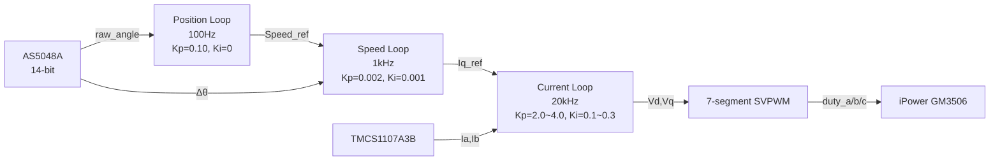

# STM32G431CBU6_MMSD — BLDC Motor FOC Vector Control Project

> **Version**: v0.1.0  
> **MCU**: STM32G431CBU6 (Cortex-M4 @ 170MHz)  
> **Driver**: DRV8313 Three-Phase MOSFET Pre-Driver  
> **Encoder**: AS5048A 14-bit Magnetic Rotary Encoder (SPI)  
> **Current Sense**: TMCS1107A3B (200mV/A, bidirectional)  
> **Target Motor**: iPower GM3506 Gimbal BLDC Motor (24N22P, 11 pole pairs)  
> **Dev Environment**: STM32CubeMX + VS Code + CMake + ARM GCC

> **[🇨🇳 查看中文版](README.md)**

---

## Table of Contents

- [Project Overview](#project-overview)
- [Hardware Architecture](#hardware-architecture)
- [Software Layers](#software-layers)
- [Control Scheme](#control-scheme)
- [Operating Modes](#operating-modes)
- [Project Structure](#project-structure)
- [Quick Start](#quick-start)
- [Tuning Guide](#tuning-guide)
- [Debug Interface](#debug-interface)
- [Project Log](#project-log)

---

## Project Overview

This project is a **Field-Oriented Control (FOC)** system for **Brushless DC (BLDC) motors** based on the **STM32G431CBU6** microcontroller, targeting the **iPower GM3506 gimbal motor**.

It adopts a **three-loop cascaded control** architecture (Position → Speed → Current), supporting:

- **Auto Step Mode** — automatically rotates 6° every 1 second, for demo and basic testing
- **Manual Teach Mode** — manually turn to a target position, hold for 6 seconds to lock
- **Damper Mode** — resistive feeling when turning, free stop when released

The code follows a **three-layer architecture** (Driver → Control → Application), plus an independent **Communication Layer** for online debug and PID tuning. Layers are decoupled with unified interfaces for easy maintenance and porting.

---

## Hardware Architecture

### Component List

| Component | Model | Description |
|-----------|-------|-------------|
| MCU | STM32G431CBU6 | Cortex-M4, 170MHz, FPU, DSP instructions |
| Motor Driver | DRV8313 | Three-Phase MOSFET Pre-Driver, with nFAULT protection |
| Magnetic Encoder | AS5048A | 14-bit (0~16383), SPI interface |
| Current Sensor | TMCS1107A3B | 200mV/A, zero current = 1.65V |
| Target Motor | iPower GM3506 | 24N22P, 11 pole pairs, 5.6Ω, 1A@12V |

### Pin Mapping

| Function | Pin | Peripheral |
|----------|-----|------------|
| PWM Phase A High | PA8 | TIM1_CH1 |
| PWM Phase B High | PA9 | TIM1_CH2 |
| PWM Phase C High | PA10 | TIM1_CH3 |
| Phase Current Ia | PA0 | ADC1_IN1 |
| Phase Current Ib | PA1 | ADC1_IN2 |
| Bus Voltage | PA7 | ADC2_IN4 |
| Bus Current | PA6 | ADC2_IN3 |
| Encoder SCK | PB3 | SPI1_SCK |
| Encoder MISO | PB4 | SPI1_MISO |
| Encoder MOSI | PB5 | SPI1_MOSI |
| Encoder CS | PA15 | GPIO software chip select |
| nFAULT Interrupt | PB11 | EXTI falling edge trigger |
| LED Indicator | PC6 | GPIO output |

### Timing Overview

```
┌─────────────────────────────────────────────────────────┐
│ TIM1 (20kHz / 50µs)  →  Trigger ADC1 → Current Sampling │
│                           + FOC Algorithm               │
│   ├── ADC1 HW Conversion:        ~6µs                   │
│   ├── ADC Callback Execution:    ~16µs                  │
│   │   ├── SPI Read Encoder:       ~10µs                 │
│   │   ├── FOC_Current_Step:      ~4.8µs (Clarke→Park→PI │
│   │   │                            →InvPark→SVPWM)      │
│   │   └── Fault Detection+Other: ~1.2µs                 │
│   ├── Interrupt Latency+Overhead: ~11µs                 │
│   └── Trigger ADC→PWM Output Total: ~33µs (66% period)  │
├─────────────────────────────────────────────────────────┤
│ TIM6 (1kHz / 1ms)     →  Speed PI  →  Update Iq Ref     │
├─────────────────────────────────────────────────────────┤
│ TIM7 (100Hz / 10ms)   →  Position PI →  Update Speed Ref│
├─────────────────────────────────────────────────────────┤
│ main loop              →  LED Heartbeat + Fault Recovery│
│                           + Mode Management             │
└─────────────────────────────────────────────────────────┘
```

---

## Software Layers

The project adopts a **three-layer architecture + independent Communication Layer**, from bottom to top: Driver → Control → Application. The Communication Layer is a peer of the Application Layer, providing a data channel for debug/tuning.

> The `Core/` and `Drivers/` directories contain HAL initialization code generated by STM32CubeMX and the ST official driver library — these are toolchain infrastructure, not hand-written layers of this project.

### 1️⃣ Driver Layer

Encapsulates peripheral operation logic, providing a unified upper-layer interface. Primarily uses direct register access, mixed with HAL calls where necessary.

> The SPI encoder driver operates `SPI1->DR/SR/CR1` registers directly; the PWM driver uses register access for CCR/BDTR but HAL for channel enable; the ADC and nFAULT drivers are mainly based on HAL callbacks.

| Module | File | Description |
|--------|------|-------------|
| ADC Sampling | `drv_adc_sampling` | ADC1/ADC2 dual-channel DMA circular sampling, current/voltage detection |
| SPI Encoder | `drv_spi_as5048a` | AS5048A 14-bit magnetic encoder SPI driver |
| PWM Output | `drv_tim_pwm` | TIM1 six-channel complementary PWM, 20kHz, configurable dead-time |
| nFAULT Protection | `drv_nfault` | DRV8313 fault interrupt handling, emergency MOE shutdown |

### 2️⃣ Control Layer

Core FOC algorithm and math library, independent of HAL, testable in isolation.

| Module | File | Description |
|--------|------|-------------|
| Math Library | `ctl_math` | Clarke/Park/InvPark transforms + 7-segment SVPWM |
| PID Controller | `ctl_pid` | Parallel PID, setpoint weighting, conditional integral anti-windup, derivative low-pass filter |
| FOC Core | `ctl_foc_core` | FOC main struct, state machine, system init, fault detection |
| Open-Loop Control | `ctl_foc_openloop` | Virtual rotating field, sensorless/no PI, for hardware verification |
| Current Loop | `ctl_foc_current` | Id=0 strategy, PI control, encoder calibration |
| Speed Loop | `ctl_foc_speed` | Speed PI controller, differential speed measurement |
| Position Loop | `ctl_foc_position` | Position PI controller, encoder unwrapping (no rollover) |
| Damper Mode | `ctl_foc_damper` | Resistive turning mode, Iq=-gain×speed, pure proportional negative feedback |

### 3️⃣ Application Layer

Encapsulates business logic; `main.c` only retains the hardware initialization skeleton.

| Module | File | Description |
|--------|------|-------------|
| App Init | `app_foc` | `App_Init()` — FOC system init + mode dispatch |
| Main Loop Task | `app_foc` | `App_Run()` — LED heartbeat + fault recovery + position control |

### 🔗 Communication Layer — Peer of Application Layer

VOFA+ JustFloat protocol, providing a data channel for online debug and PID tuning.

| Module | File | Description |
|--------|------|-------------|
| JustFloat Protocol | `prot_justfloat` | VOFA+ JustFloat binary frame build/parse (raw float32 bytes, far more efficient than CSV/JSON) |
| Online Tuning | `diag_tuning` | UART IDLE + DMA bidirectional communication, online PID gains/current ref/speed/position/mode switching |

---

## Control Scheme

### Three-Loop Cascaded Control



### Current Loop (20kHz, TIM1)

- Strategy: **Id=0** (maximum torque per ampere)
- Control period: **50µs**
- Algorithm flow: Read ADC → Read Encoder → Clarke Transform → Park Transform → **Dual PI (Id/Iq)** → InvPark → SVPWM
- PI gains: **Kp=2.0~4.0, Ki=0.1~0.3**, clamp ±Vbus
  - Current/Speed mode: Kp=4.0, Ki=0.3
  - **Position mode**: Kp=2.0, Ki=0.1 (reduces ADC noise amplification, no oscillation at standstill)
- Current filtering: **IIR α=0.3** (cutoff ~1.1kHz @ 20kHz sampling)

### Speed Loop (1kHz, TIM6)

- Speed measurement: Encoder electrical angle differential with rollover detection
- Control period: **1ms**
- Output clamp: ±1A (clamped to Iq_ref)
- Speed hard limit: **±2000 RPM**
- PI gains: **Kp=0.002, Ki=0.001**

### Position Loop (100Hz, TIM7)

- Encoder unwrapping: Two-step method — ① detect ±8192 rollover direction, accumulate unwrapped position ② re-wrap to setpoint ±8192 to prevent float32 precision degradation
- Control period: **10ms**
- Output clamp: ±500RPM (clamped to speed_ref)
- PID gains: **Kp=0.10, Ki=0, Kd=0.03** (includes derivative term for enhanced damping, reduces overshoot)

---

## Operating Modes

### 1️⃣ Position Control — Auto Step Mode

**Macro**: `POS_AUTO_STEP = 1`

- Steps **273 LSB** (≈ 6° mechanical) every **1 second**
- Position loop locks target angle, speed/current loops follow
- Use case: Basic demo, control performance evaluation

### 2️⃣ Position Control — Manual Teach Mode

**Macro**: `POS_AUTO_STEP = 0`

- Manually rotate the motor away from current position
- After deviation **>500 LSB**, hold for **6 seconds** to lock as new target
- Release → position loop returns to locked position
- Use case: Mechanical assembly calibration, position teaching

### 3️⃣ Damper Mode

**Macro**: `FOC_MODE = FOC_MODE_DAMPER`

- Turning generates resistance (`Iq = -gain × speed`), no integral term
- Faster turning = stronger resistance; release = free stop
- Parameter: Default damping gain **0.02 A/RPM** (configurable range 0.02~0.1 A/RPM)
- Use case: Dynamometer simulation, haptic tuning

### 4️⃣ Open-Loop Verification Mode

For hardware chain verification and first motor spin test, independent of encoder feedback and PI gains.

- Software generates virtual rotating field
- No encoder calibration needed
- Sensorless; may lose sync under load

---

## Project Structure

```
STM32G431CBU6_MMSD/
├── CMakeLists.txt              # CMake build file
├── CMakePresets.json           # CMake presets (Debug/Release)
├── startup_stm32g431xx.s       # Startup file
├── STM32G431XX_FLASH.ld        # Linker script
├── STM32G431CBU6_MMSD.ioc      # STM32CubeMX configuration
│
├── ApplicationLayer/           # Application layer
│   ├── Inc/app_foc.h
│   └── Src/app_foc.c
│
├── ControlLayer/               # Control layer (FOC algorithm core)
│   ├── Inc/                    # Headers
│   │   ├── ctl_math.h          #   Coordinate transforms & SVPWM
│   │   ├── ctl_pid.h           #   PI/PID controller
│   │   ├── ctl_foc_core.h      #   FOC infrastructure
│   │   ├── ctl_foc_current.h   #   Current loop
│   │   ├── ctl_foc_speed.h     #   Speed loop
│   │   ├── ctl_foc_position.h  #   Position loop
│   │   ├── ctl_foc_openloop.h  #   Open-loop control
│   │   └── ctl_foc_damper.h    #   Damper mode
│   └── Src/                    # Source files (same name .c)
│
├── DriverLayer/                # Driver layer
│   ├── Inc/
│   │   ├── drv_adc_sampling.h  #   ADC current/voltage sampling
│   │   ├── drv_spi_as5048a.h   #   AS5048A encoder
│   │   ├── drv_tim_pwm.h       #   TIM1 PWM output
│   │   ├── drv_nfault.h        #   DRV8313 fault protection
│   │   └── drv_spi_as5048a_debug.h
│   └── Src/                    # Source files
│
├── CommunicationLayer/         # Communication layer (online debug & tuning)
│   ├── Inc/
│   │   ├── prot_justfloat.h    #   VOFA+ JustFloat protocol
│   │   └── diag_tuning.h       #   Online PID tuning
│   └── Src/                    # Source files
│
├── Core/                       # STM32CubeMX generated
│   ├── Inc/                    # Peripheral headers + main.h
│   └── Src/                    # Peripheral init + main.c + interrupts
│
├── Drivers/                    # CMSIS + STM32G4 HAL library
│
├── cmake/                      # CMake toolchain
│   ├── gcc-arm-none-eabi.cmake
│   ├── starm-clang.cmake
│   └── stm32cubemx/            # CubeMX generated CMake
│
└── document/                   # Documentation
    ├── 编程日志.txt
    ├── FOC_项目深度复盘.md
    └── FOC_项目总结与面试准备.md
```

---

## Quick Start

### Prerequisites

- **VS Code** (recommended) or STM32CubeIDE
- **ARM GCC toolchain** (`arm-none-eabi-gcc`)
- **CMake** ≥ 3.22
- **STM32CubeMX** (for regenerating init code)
- **Serial terminal** 115200-8-N-1 (for debug output)

### Build

```bash
# Debug mode
cmake --preset Debug
cmake --build build/Debug

# Release mode
cmake --preset Release
cmake --build build/Release
```

### Flash

Use ST-Link tools:

```bash
# Using STM32_Programmer_CLI
STM32_Programmer_CLI --connect port=SWD --write build/Debug/STM32G431CBU6_MMSD.hex --verify
```

Or flash via VS Code + Cortex-Debug extension.

### Run

1. Connect the motor (iPower GM3506) to DRV8313 outputs
2. Connect 12V power to the driver board
3. On power-up, the program auto-initializes the FOC system
4. LED (PC6) blinks at **1Hz** indicating normal operation
5. Motor runs in the current mode (Auto Step / Manual Teach / Damper)

---

## Tuning Guide

### Current Loop PI Gains

| Parameter | Recommended | Description |
|-----------|-------------|-------------|
| Kp (Id/Iq) | 2.0~6.0 | Proportional gain: higher = faster response, too high → oscillation |
| Ki (Id/Iq) | 0.1~0.5 | Integral gain: eliminates steady-state error, too high → low-freq oscillation |
| Output clamp | ±Vbus | Set to bus voltage |
| Integral clamp | ±Vbus×0.3 | Anti-windup, prevents deep integral saturation |

**Tuning steps**:
1. After correct encoder calibration, lock the motor shaft (or attach high-inertia load)
2. Set Ki=0, increase Kp until current response shows critical oscillation
3. Use **60%~80%** of critical Kp as final Kp
4. Add Ki ≈ Kp × 0.05~0.1
5. Observe Id/Iq tracking with oscilloscope or serial output

### Speed Loop PI Gains

| Parameter | Recommended | Description |
|-----------|-------------|-------------|
| Kp | 0.001~0.005 | Proportional gain: controls speed response |
| Ki | 0.0005~0.002 | Integral gain: eliminates speed steady-state error |
| Output clamp | ±1.0A | Clamped to current loop Iq_ref |

### Position Loop PI Gains

| Parameter | Recommended | Description |
|-----------|-------------|-------------|
| Kp | 0.05~0.20 | Proportional gain: controls position stiffness |
| Ki | 0 (pure P) | Position loop typically needs no integral |
| Output clamp | ±500RPM | Clamped to speed loop speed_ref |

---

## Debug Interface

### VOFA+ JustFloat Online Tuning (USART1)

Real-time FOC data visualization and online PID tuning via the **VOFA+** host software with the **JustFloat** data engine — no recompilation or reflashing needed.

- Baud rate: **115200-8-N-1**
- Protocol: **JustFloat** (raw float32 binary frames, far more efficient than CSV/JSON/printf)
- Frame format: `[Ch0][Ch1]...[ChN-1][Tail: 00 00 80 7F]`, 4 bytes per channel, little-endian
- Enable: `#define TUNING_ENABLE 1` (in `diag_tuning.h`)
- Send period: **5ms** (200Hz), non-blocking DMA

**Uplink** (MCU → VOFA+, channel layout auto-switches by mode):

| Mode | Channels |
|------|----------|
| CURRENT | Id_ref, Id, Iq_ref, Iq, Vd, Vq, Ia, Ib, speed_rpm, mode (10ch) |
| SPEED | speed_ref, speed_rpm, iq_ref, Iq, Vq, Ia, Ib, mode (8ch) |
| POSITION | pos_cmd, pos_fb, speed_ref, speed_rpm, Iq, Vq, Ia, Ib, mode (9ch) |
| DAMPER | Same as POSITION (9ch) |

**Downlink** (VOFA+ → MCU, online parameter modification):

| Cmd | Parameter | Description |
|-----|-----------|-------------|
| 1~4 | Current loop Kp_id / Ki_id / Kp_iq / Ki_iq | Online current PI gain tuning |
| 5~8 | Speed loop Kp / Ki / Kd / Kr | Online speed PID gain tuning |
| 9~12 | Position loop Kp / Ki / Kd / Kr | Online position PID gain tuning |
| 13~16 | Id_ref / Iq_ref / Speed_ref / Pos_ref | Online reference modification |
| 17 | Mode (2/3/4/5) | Online switch CURRENT/SPEED/POSITION/DAMPER |

> VOFA+ config: Select JustFloat data engine, sender panel uses 2 channels (ch0=cmd code, ch1=value).

### Simplified Debug Print

If no host software is available, enable `#define DEBUG_PRINT 1` in `app_foc.h` for compact CSV output every **20ms** in `App_Run()`:

```
  tick   Id       Iq       Vd      Vq      rpm   theta
  1000  +0.0100  +0.4900  +2.300  +4.100  120.5   12.50
```

### Fault Codes

| Fault Code | Meaning | Action |
|------------|---------|--------|
| `FOC_FAULT_OVERCURRENT` | Phase current exceeds 2.5A limit | Emergency MOE shutdown (debounce 5 × 50µs = 250µs) |
| `FOC_FAULT_OVERVOLTAGE` | Bus voltage exceeds 20V | Emergency MOE shutdown |
| `FOC_FAULT_UNDERVOLTAGE` | Bus voltage below 0.5V (cannot modulate properly) | Emergency MOE shutdown |
| `FOC_FAULT_ENCODER` | Encoder communication error (SPI failure) | Flag fault, debounce 100 cycles (5ms) before shutdown |
| `DRV8313_nFAULT` | Driver IC reports overcurrent/overtemp/undervoltage | Shutdown MOE + EN pin |

### Auto-Recovery

- **500ms** delay before auto-recovery attempt
- Recovery sequence: clear fault code → reset all PIDs → re-enable MOE → restore RUNNING state
- Hierarchical fault debounce: hard faults (overcurrent/overvoltage/undervoltage) require 5 consecutive triggers, encoder fault requires 100 consecutive triggers

---

## Project Log

| Date | Milestone |
|------|-----------|
| 2026-06-17 | ADC sampling driver completed (TMCS1107A3B) |
| 2026-06-18 | TIM1 PWM driver completed (20kHz) |
| 2026-06-19 | ADC + PWM timing verified, ~6µs conversion |
| 2026-06-22 | Sampling + PWM drivers fully verified |
| 2026-06-23 | AS5048A encoder driver completed, ~10µs read |
| 2026-06-24 | Three-loop cascaded FOC control completed, ADC trigger→PWM output total ~33µs |
| 2026-06-25 | Auto step, manual teach, damper modes all implemented |
| 2026-06-25 | README documentation corrected: step 273LSB(6°), position loop Kd, mode-specific current PI, etc. |
| 2026-06-27 | Communication layer completed: VOFA+ JustFloat protocol + online PID tuning (UART IDLE + DMA bidirectional) |
| 2026-06-30 | v0.1.0: README docs updated, version number added, communication layer & online tuning documented |

---

## References

- [STM32G4 Reference Manual (RM0440)](https://www.st.com/resource/en/reference_manual/dm00463896.pdf)
- [DRV8313 Datasheet](https://www.ti.com/lit/ds/symlink/drv8313.pdf)
- [AS5048A Datasheet](https://ams.com/documents/20143/36005/AS5048A_DS000744.pdf)
- [iPower GM3506 Motor Specs](document/iPower%20GM3506%20Gimbal%20Motor%20with%20Encoder%20Specifications.txt)
- [FOC Project Deep Review (Chinese)](document/FOC_项目深度复盘.md)
- [Chinese Version of This README](README.md)

---

> **Maintainer**: lidongyang  
> **License**: For reference and learning only. Not authorized for commercial use without permission.
