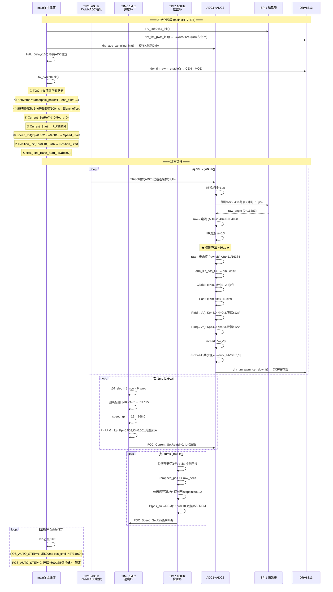
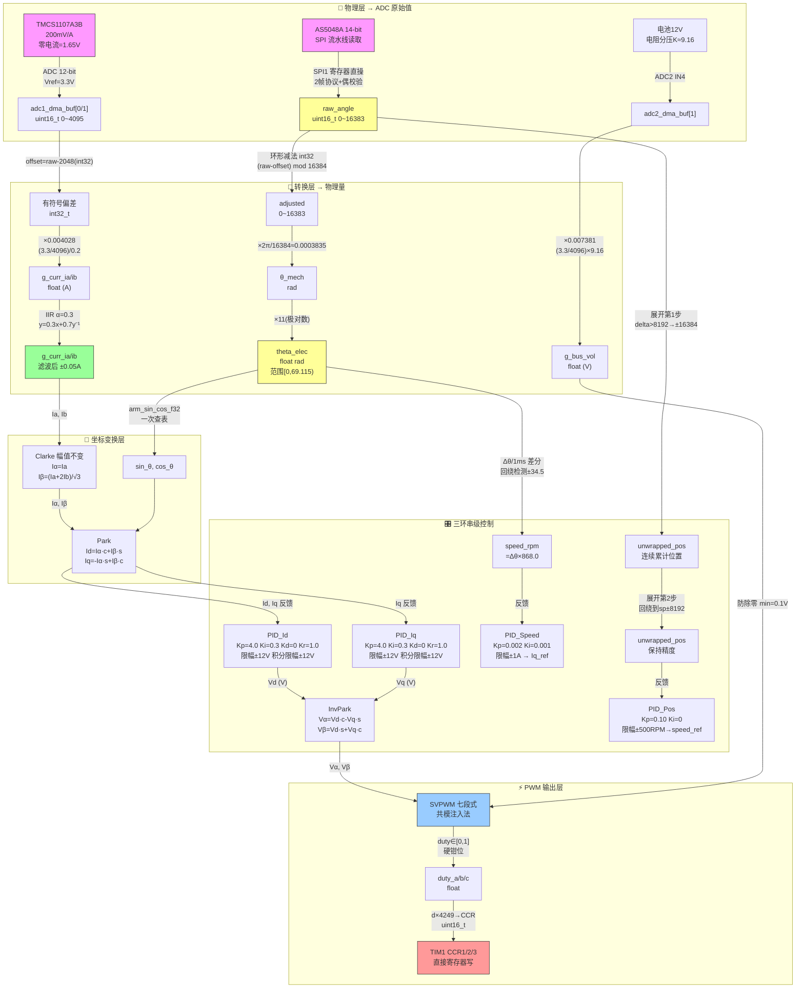
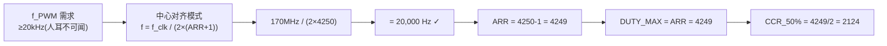
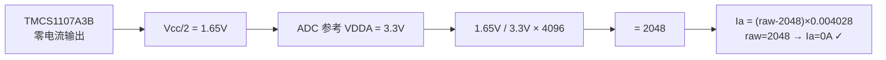
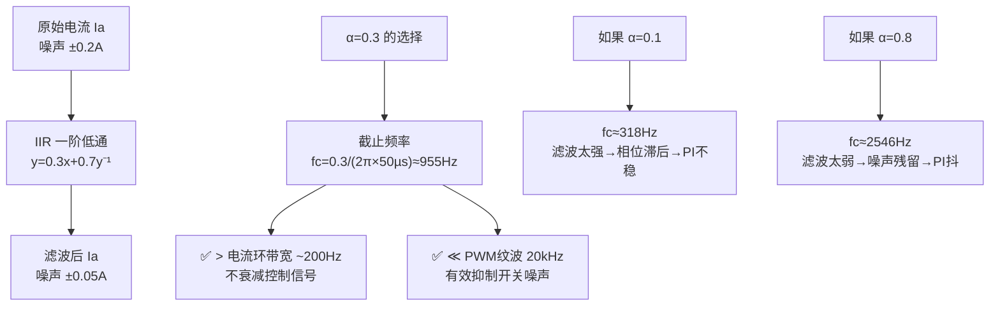
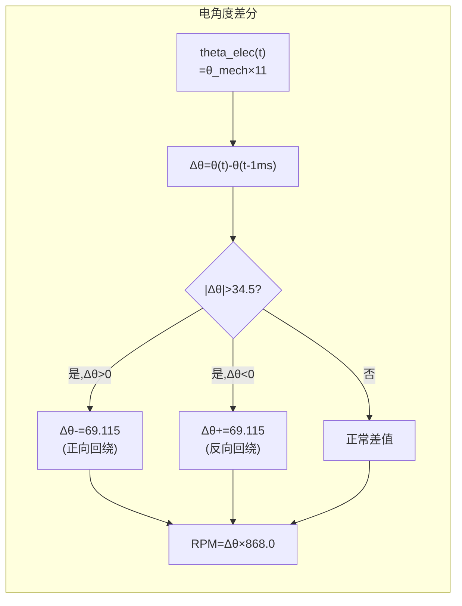
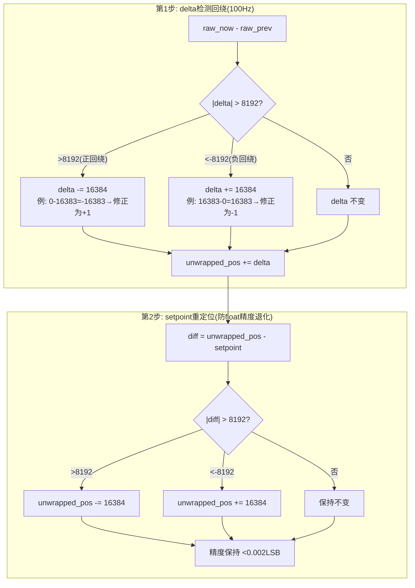
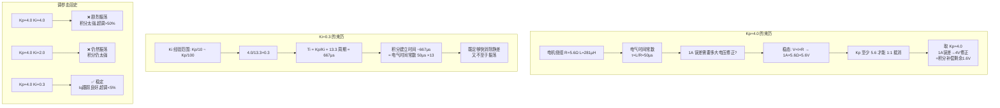
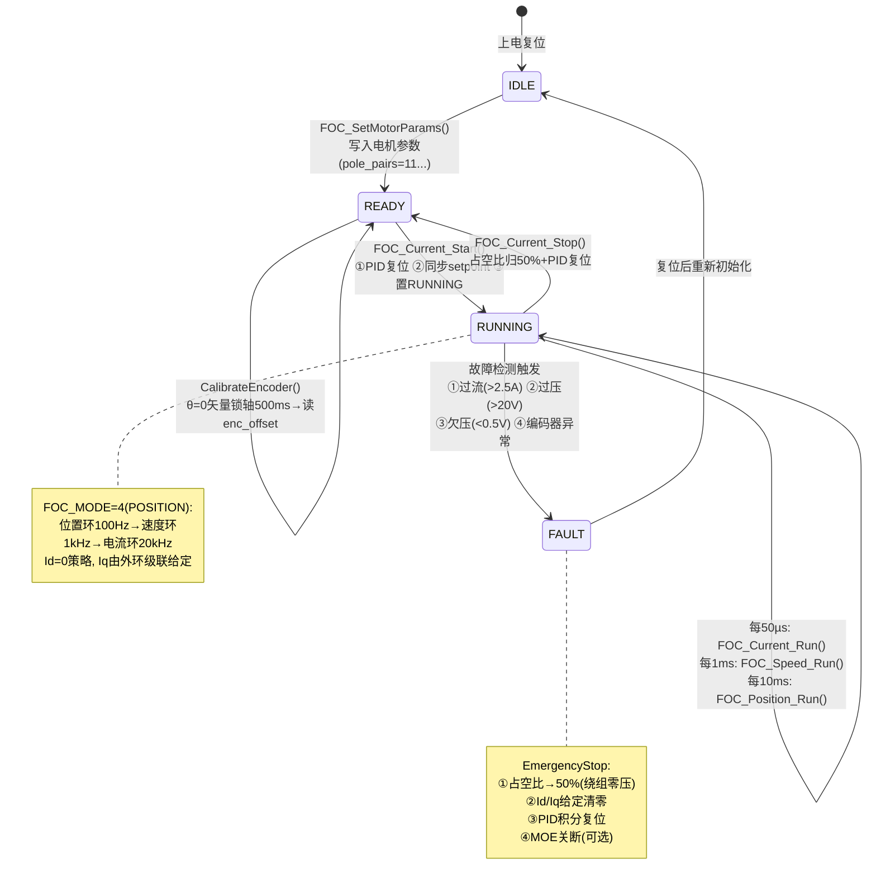

# 🔬 STM32 FOC 电机控制项目 — 系统级深度复盘

> **硬件**：STM32G431CBU6 @ 170MHz · DRV8313 · AS5048A 14-bit · TMCS1107A3B
> **电机**：iPower GM3506 云台电机（24N22P, 11对极, $R=5.6\Omega$, $L\approx 281\mu H$）
> **日期**：2026-06-24

---

## 目录

1. [系统时序全景图](#一系统时序全景图)
2. [数据流与变量血缘图](#二数据流与变量血缘图)
3. [关键变量词典](#三关键变量词典)
4. [状态机全景图](#四状态机全景图)
5. [关键阈值速查表](#五关键阈值速查表)
6. [PI 参数整定速查](#六pi-参数整定速查)
7. [性能预算](#七性能预算)

---

## 一、系统时序全景图



---

## 二、数据流与变量血缘图



---

## 三、关键变量词典 — 每个数字的完整来龙去脉

### 🔢 变量: `PWM_ARR = 4249`



| 层级 | 问题 | 答案 |
|------|------|------|
| **源头** | 为什么是 20kHz？ | 人耳听觉上限 ~20kHz，低于此频率 PWM 啸叫可闻 |
| **推导** | 为什么中心对齐？ | 对称 PWM 谐波更少，适合电机控制；每个周期两次更新机会 |
| **公式** | 为什么 ARR=4249 而非 4250？ | 计数器 0 开始 → N+1 个步进，频率 = f/(2×(ARR+1)) |
| **影响** | ARR=4249 意味着什么？ | 占空比分辨率 1/4250 ≈ 0.024%，电压精度足够 |

---

### 🔢 变量: `ADC_CURR_OFFSET = 2048`



| 层级 | 问题 | 答案 |
|------|------|------|
| **为什么是 1.65V** | TMCS1107A3B 供电 3.3V，零电流输出 Vcc/2 | 双向电流传感器，正负电流各用一半量程 |
| **为什么用 4096 而非 4095** | $V_{ref}/2^N$ 定义 1 LSB | 虽然 max code=4095，但量化阶梯是 Vref/4096 |
| **为什么转 int32_t** | `(int32_t)raw - 2048` | uint16_t 减法下溢会回绕到 65535；int32_t 得到负值 |

---

### 🔢 变量: `ADC_CURR_SCALE = 0.004028f`

```
每 LSB 对应电流 = (Vref/2^N) / 灵敏度
               = (3.3V/4096) / 0.2V/A
               = 0.0008057 / 0.2
               = 0.004028 A/LSB

验证链:
  raw=2048 → offset=0   → Ia=0.000A  ← 零电流
  raw=2296 → offset=248 → Ia=0.999A  ← ~1A ✓
  raw=1800 → offset=-248→ Ia=-0.999A ← ~-1A ✓
```

**为什么不直接用 `(raw - 2048) * 3.3 / 4096 / 0.2`**：每次 ADC 回调都算一次浮点除法 → 20kHz × 3 操作 = 6 万次/秒浪费。预计算为常量 → 单条 FMUL 指令，1 CPU 周期。

---

### 🔢 变量: `ADC_CURR_FILT_ALPHA = 0.3f`



| 对比维度 | α=0.1 | α=0.3✅ | α=0.8 |
|---------|-------|---------|-------|
| 截止频率 | 318Hz | 955Hz | 2546Hz |
| 噪声抑制 | 强 | 中 | 弱 |
| 相位滞后 | ~500µs | ~160µs | ~60µs |
| 电流环影响 | 可能振荡 | 稳定 | Id/Iq 抖动 |

---

### 🔢 变量: `2731.0f` (位置步进量)

```
目标: 每步旋转 60° 机械角

一圈 = 360° = 16384 LSB (AS5048A 14-bit)
 60° = 60/360 × 16384
     = 1/6 × 16384
     = 2730.666...

取 2731 → 实际步进 = 2731/16384×360 = 59.99° ≈ 60°

为什么不是 2730?  
  2730/16384×360 = 59.98° → 累加6步后误差 0.12°
  2731/16384×360 = 59.99° → 累加6步后误差 0.06°
  ↓
  2731 更接近真值，且奇数在连续步进中累积误差更小
```

---

### 🔢 变量: `868.0f` (转速系数)

```
RPM = Δθ_elec / P × (60 / 2π) × (1 / Δt)
     = Δθ_elec / 11 × 9.5493 × 1000
     = Δθ_elec × 868.118...

取 868.0 → 精度 ±0.014%

为什么是电角度差分而非编码器差分?
  编码器: 1ms内Δraw ≈ 20 LSB @500RPM → 分辨率粗
  电角度: 1ms内Δθ_elec ≈ 0.6 rad → 放大11倍 → 分辨率细11倍
```



**回绕阈值 34.5 的来历**：
```
电角度范围 = 2π × 11 = 69.115038379 rad
半圈 = 69.115 / 2 = 34.5575... ≈ 34.5

1ms 内正常 Δθ:
  @2000RPM → 2000×11×2π/60×0.001 ≈ 2.3 rad ≪ 34.5 ✓
  
如果 |Δθ| > 34.5 → 一定发生了跨周期回绕，不是真实速度
```

---

### 🔢 变量: `8192.0f` (位置展开阈值)



**为什么 8192 = 16384/2**：
- 相邻两次采样的角度变化不可能超过半圈（100Hz × 半圈 ≈ 50转/秒 = 3000RPM，远超实际）
- 8192 是**检测阈值**而非精度损失点——超过半圈的变化一定是回绕

**为什么需要第 2 步（float32 精度退化）**：

| 累计圈数 | unwrapped_pos (LSB) | float32 精度 (LSB) | 还能控制吗 |
|---------|---------------------|-------------------|-----------|
| 0 | 0 | 0.001 | ✅ |
| 10 | 163,840 | 0.02 | ✅ |
| 100 | 1,638,400 | 0.2 | ⚠️ 抖动 |
| 1000 | 16,384,000 | 1.95 | ❌ 失效 |

> float32 尾数 23 位 → 相对精度 ≈ 1.2×10⁻⁷。unwrapped_pos 越大，绝对分辨率越差。第 2 步把值保持在 setpoint±8192 范围内 → 绝对精度始终 < 8192/2²³ ≈ 0.001 LSB。

---

### 🔢 变量: `loop_count > 2000U` (故障检测延时)

```
2000 周期 × 50µs/周期 = 100ms

为什么是 100ms？
  ① 电机启动浪涌电流可达 2-3 倍额定值
  ② PI 建立时间约 20-50 个周期(1-2.5ms)
  ③ 电流环从 0→目标需要 ~10ms
  ④ 取 100ms 是 ③ 的 10 倍安全余量

为什么用 loop_count 而非 HAL_GetTick？
  ① loop_count 在 20kHz ISR 中原子递增，精度 50µs
  ② HAL_GetTick 精度 1ms，100ms 内可能因中断延迟误差 ±2ms
  ③ ISR 内用 HAL_GetTick 需要额外函数调用开销
```

---

### 🔢 变量: 电流环 `Kp=4.0, Ki=0.3`



**为什么电流环积分限幅要覆盖为 ±12V**：绕组电感 281µH 在 12V 下的电流上升率 = 12V/281µH = 42.7 A/ms。50µs 内只能建立 2.1A。如果积分限幅只有 30%（±3.6V），积分项不足以补偿电感压降。

---

### 🔢 变量: 位置环 `Kp=0.10, Ki=0`

```
为什么 Kp=0.10 (单位: RPM/LSB)?
  1 LSB 误差 → 输出 0.10 RPM
  500 LSB 误差 (示教死区) → 输出 50 RPM (平缓启动)
  16384 LSB 误差 (半圈) → 输出上限 500 RPM (限幅起作用)

为什么 Ki=0 而非低速积分?
  ① 云台电机摩擦力极低 (轴承+磁滞<0.01Nm)
  ② 纯 P 稳态误差 = 负载转矩/Kp ≈ 0 (空载)
  ③ I 会累积编码器量化误差 → 来回振荡
  ④ 0.10 × 5 LSB = 0.5 RPM → 电流环足以处理

如果强制加 Ki=0.01 会怎样?
  → 转子到达目标后积分未衰减完 → 冲过头
  → 反向积分累积 → 冲回来
  → 极限环振荡
```

---

### 🔢 变量: `500.0f` (位置示教死区) & `6000U` (示教保持时间)

```
死区 500 LSB = 500/16384 × 360° ≈ 10.99° ≈ 11°

为什么是 11° 而非 2° 或 30°?
  太小(2°): 手指轻微触碰就触发 → 误触发严重
  太大(30°): 需要刻意大幅度拧 → 使用体验差
  11°:   有意拧动(>11°)才触发，无意识碰触(<5°)不触发 ✓

保持时间 6 秒:
  ① 区分"路过"和"停留" → 必须稳住 6 秒才算"新目标"
  ② 太短(1s): 拧动过程中就锁定 → 锁定在非期望位置
  ③ 太长(15s): 等待时间过久 → 体验差
  ④ 6s ≈ 位置环稳定时间的 100 倍余量 → 确保已经完全到位
```

---

## 四、状态机全景图



---

## 五、关键阈值速查表

| 阈值 | 值 | 单位 | 物理含义 | 设计理由 |
|------|------|------|----------|----------|
| `8192` | 16384/2 | LSB | 半圈编码器 | 回绕检测最大合理步长 |
| `34.5` | 69.115/2 | rad | 半圈电角度 | 电角度回绕检测阈值 |
| `69.115` | 2π×11 | rad | 一圈电角度 | 11 对极下全电周期 |
| `500` | ~11° | LSB | 示教死区 | 有意拧 vs 无意碰 |
| `6000` | 6s | ms | 示教保持 | 区分路过和停留 |
| `2000` | 100ms | 周期 | 故障检测延时 | 躲过启动浪涌 |
| `2731` | 60° | LSB | 步进步长 | 60°机械角 |
| `0.3` | α | 无量纲 | ADC IIR 滤波 | 截止 955Hz |
| `0.3` | ratio | 无量纲 | 积分限幅比例 | 积分最多占 30% 输出 |
| `0.1` | α | 无量纲 | 微分 IIR 滤波 | 截止 318Hz |
| `100` | ms | ms | ADC 稳定等待 | 电源+传感器建立 |

---

## 六、PI 参数整定速查

| 环路 | Kp | Ki | Kp/Ki 比值 | TI(等效) | 限幅 | Kr |
|------|-----|-----|-----------|----------|------|-----|
| **电流 Id** | 4.0 V/A | 0.3 | 13.3 | 667µs | ±12V | 1.0 |
| **电流 Iq** | 4.0 V/A | 0.3 | 13.3 | 667µs | ±12V | 1.0 |
| **速度** | 0.002 A/RPM | 0.001 | 2.0 | 2ms | ±1A | 1.0 |
| **位置** | 0.10 RPM/LSB | **0** | ∞ | ∞ | ±500RPM | 1.0 |

> Kp/Ki 比值 = 等效积分时间常数（离散周期数）。电流环 ~13 周期快速消除静差，速度环 ~2 周期偏比例主导，位置环纯 P 杜绝积分振荡。

---

## 七、性能预算

| 环节 | 耗时 | 占比(50µs) |
|------|------|-----------|
| ADC 转换 | ~6µs | 12% |
| 编码器 SPI 读取 | ~10µs | 20% |
| sin/cos 查表 ×2 | ~0.3µs | <1% |
| Clarke+Park+PI×2+InvPark | ~1.5µs | 3% |
| SVPWM | ~1.5µs | 3% |
| PWM CCR 写入 | ~0.2µs | <1% |
| **总控制算法** | **~3.5µs** | **~7%** |
| **全流程(含ADC+SPI)** | **~16µs** | **~32%** |

> CPU 余量 ~68%，足够扩展 CAN 通信、更复杂的位置规划、在线参数整定等功能。

---

## 附录：面试要点串联

| 面试问题 | 项目中的体现 |
|---------|------------|
| **为什么用 Id=0 控制** | 表贴式 PMSM，永磁体已提供转子磁场，Id=0 最大化转矩/电流比 |
| **三环串级的带宽关系** | 电流 20kHz > 速度 1kHz > 位置 100Hz，内环带宽 > 外环 10 倍+ |
| **积分抗饱和怎么做** | 条件积分：输出饱和且误差同向时冻结积分，异向时允许退饱和 |
| **位置环为什么纯 P** | 云台低摩擦，P 稳态误差 < 0.2° 可接受，I 导致过冲振荡 |
| **编码器回绕怎么处理** | 两步法：①delta 检测回绕方向累加 ②定期回绕到 setpoint ±8192 防精度退化 |
| **SVPWM 为什么用共模注入** | 比扇区法少 6 路分支，纯算术运算，M4 上更快 |
| **为什么用 float 不用 Q 格式** | M4 有硬件 FPU，float 单周期，物理量可读性碾压定点 |
